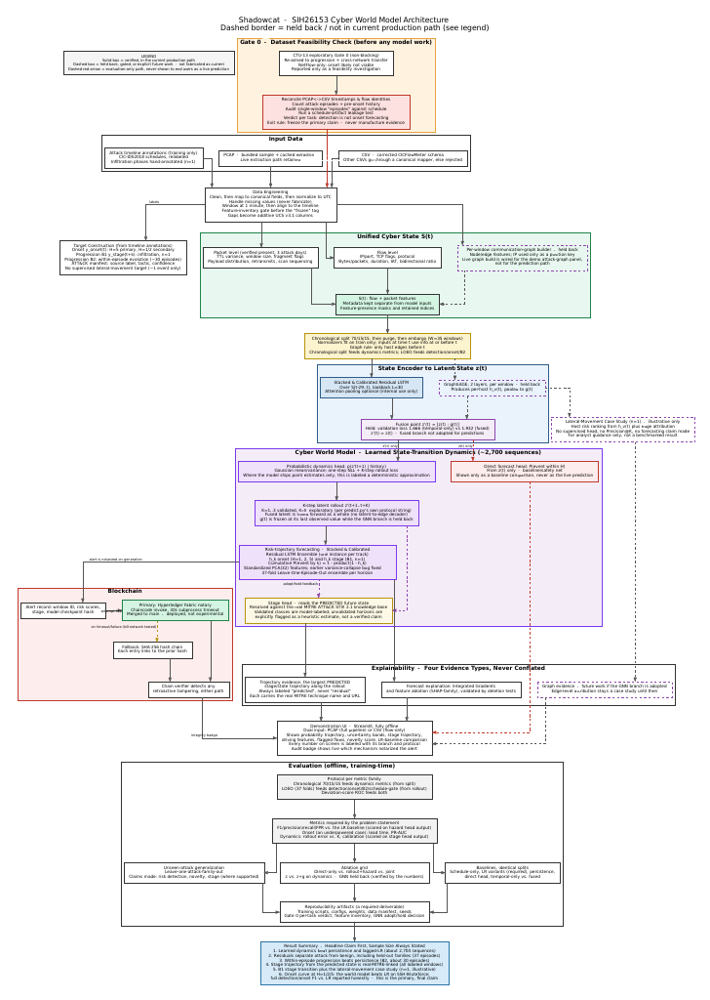

# SHADOWCAT

**A network world model for early attack warning, with a tamper-evident audit trail.**
Smart India Hackathon 2026 · Problem Statement `SIH26153` · NTRO


**Contents:** [Problem statement](#sih-problem-statement-reference) ·
[Project briefing](#project-briefing) · [Reproduce](#reproduce-everything-in-one-command) ·
[Results](#validated-results-37-fold-leave-one-episode-out-ucs_windows_models_v1parquet) ·
[Architecture](#pipeline-architecture) · [Highlights](#highlights) ·
[Dataset issue](#the-dataset-issue-our-research-finding) ·
[Experiments](#experiments-we-ran-to-address-the-dataset-issue) · [GraphSAGE](#graphsage-graph-fusion-ml2-held-back) ·
[Installation](#installation--usage-guide) · [Deliverables](#deliverables)

---

## SIH Problem Statement Reference

- **ID:** `SIH26153`
- **Organization:** National Technical Research Organisation (NTRO)
- **Theme:** Blockchain & Cybersecurity
- **Core mission:** move perimeter defence from reactive signature matching towards learned, leakage-controlled
  estimation of attack onset from network traffic, with tamper-evident cryptographic provenance.

---

## Project Briefing

ShadowCat watches enterprise network traffic one minute at a time and estimates whether an attack is under way
or about to start, which ATT&CK tactic it belongs to, and whether the traffic looks like anything it has seen
before. Every model, report and forecast is signed into a tamper-evident audit chain, and the whole system runs
offline.

- **Input:** CICFlowMeter flow records, or raw **PCAP / PCAPNG** captures uploaded on the dashboard.
- **Unified Cyber State (UCS):** a 406-feature state per 1-minute window: 388 flow features, 12 packet-level
  features parsed from raw captures, and 6 presence masks so missing telemetry is never zero-filled.
- **World model:** an LSTM learns how the network state evolves (30-minute lookback, K-step rollout). Its
  next-state deviation flags attack families it was never trained on.
- **Prediction heads:** a stacked ensemble gives P(attack now) and P(attack within 5 minutes) with a split-conformal
  interval; a classifier names the current ATT&CK tactic, exported as STIX 2.1.
- **Audit:** an Ed25519-signed SHA-256 hash chain with a signed Merkle root over all entries (a short
  inclusion proof for any forecast), and optional Hyperledger Fabric notarisation.
- **Dashboard:** a Streamlit SOC console showing the forecast, ranked flows, host graph, explanations and audit status.
- **Evaluation:** 37-fold leave-one-episode-out on CSE-CIC-IDS2018 with a 36-window purge, thresholds chosen
  without test labels, and a leave-one-day-out stress test. Our research also measures how far public datasets
  support multi-step forecasting ([dataset issue](#the-dataset-issue-our-research-finding)).

---

## Reproduce everything in one command

```bash
pip install -r requirements.txt
python reproduce.py          # about 5 min on a laptop CPU
python reproduce.py --full   # also retrains models (about 40 min, CPU only)
```

`reproduce.py` recomputes each result and checks it against the committed artifact. It never modifies committed
files.

| Quick mode | Full mode adds |
|---|---|
| Environment and dataset checksum | ATT&CK tactic classifier retrained (37 folds) |
| All automated tests | Leave-one-day-out stress test (models retrained) |
| End-to-end `predict()` on real windows | Probabilistic K=1..5 forecast (world model retrained per fold) |
| Audit chain built and signature-verified | |
| Headline benchmark: all 37 fold models must reproduce | |
| Thresholds chosen without test labels, and the final-dataset baseline | |

It prints a PASS/FAIL table and writes `runtime/REPRODUCE_REPORT.md`.

---

## Validated results (37-fold leave-one-episode-out, `ucs_windows_models_v1.parquet`)

| Task | Model | ROC-AUC | F1 (threshold without test labels) | Test false-alarm rate |
|---|---|---|---|---|
| Detection | Stacked ensemble | **1.000** | **0.990** | 0.0% |
| Detection | Logistic regression, same final features | 1.000 | 0.980 | 0.0% |
| Onset (≤ 5 min) | Stacked ensemble | **0.962** | **0.907** | 0.4% |
| Onset (≤ 5 min) | Logistic regression, same final features | 0.952 | 0.896 | 0.4% |

- **The UCS representation does most of the work.** On the final feature set even a linear model detects attacks on
  unseen episodes almost perfectly. The stacked model matches it on detection and leads on onset.
- **Unseen attack families** (leave-one-day-out stress test, models retrained): the supervised models reach a pooled
  ROC-AUC of 0.666 (stacked) and 0.631 (LR). The world model's unsupervised deviation score reaches 0.707 on held-out
  families. This is the case for combining supervised detection with world-model deviation.
- **Early warning on true precursor windows** (no attack yet, attack within 5 minutes): ROC-AUC 0.625 on 15
  held-out precursor windows, limited by how few precursors the public data contains ([dataset issue](#the-dataset-issue-our-research-finding)).

---

## Pipeline Architecture



```
┌─ GATE 0 · DATASET FEASIBILITY CHECK (before any model work) ─────────────────────────────────┐
│  CSE-CIC-IDS2018 (adopted) · CTU-13 · CIC-IDS2017 · 10-day expansion · AIT-LDS v2.0          │
│  UWF-ZeekData24 · DAPT2020 / Unraveled                                                       │
│  └─► reconcile PCAP ↔ CSV · count episodes and pre-onset history · schedule-leakage test     │
└───────────────────────────────────────────────┬──────────────────────────────────────────────┘
                                                ▼
┌─ INPUT DATA ─────────────────────────────────────────────────────────────────────────────────┐
│  Attack timeline annotations · PCAP / PCAPNG upload (dashboard)                              │
│  CICFlowMeter CSV (other schemas mapped or rejected)                                         │
└───────────────────────────────────────────────┬──────────────────────────────────────────────┘
                                                ▼
   DATA ENGINEERING   canonical fields · UTC · 1-minute windows · missing values masked ──► targets
                                                ▼
┌─ UNIFIED CYBER STATE S(t) · 406 features ────────────────────────────────────────────────────┐
│  Flow level (388) · Packet level (12, parsed from raw PCAP) · Presence masks (6)             │
│  Communication-graph builder   [held back]                                                   │
└───────────────────────────────────────────────┬──────────────────────────────────────────────┘
                                                ▼
   LEAKAGE CONTROL    37-fold leave-one-episode-out · 36-window purge · per-fold scaler, PCA-32, LR
                                                ▼
┌─ STATE ENCODER → LATENT STATE z(t) ──────────────────────────────────────────────────────────┐
│  Stacked & calibrated residual LSTM over S(t-29..t)                                          │
│  GraphSAGE fusion   [held back: validation loss 1.932 fused vs 1.666 temporal-only]          │
│  └─► z'(t) = z(t)                                                                            │
└───────────────────────────────────────────────┬──────────────────────────────────────────────┘
                                                ▼
┌─ CYBER WORLD MODEL · learned state-transition dynamics ──────────────────────────────────────┐
│  Probabilistic dynamics head p(S(t+1) | history) ──► K-step rollout (K = 1..5)               │
│  World-model deviation ──► novelty score for unseen attack families                          │
│  Stacked ensemble ──► P(attack now), P(attack within 5 min) + split-conformal interval       │
│  Stage head ──► current ATT&CK tactic, resolved against MITRE ATT&CK STIX 2.1                │
└──────────────┬───────────────────────────────┬───────────────────────────────┬───────────────┘
               ▼                               ▼                               ▼
┌─ BLOCKCHAIN ────────────────┐ ┌─ EXPLAINABILITY ────────────┐ ┌─ EVALUATION ────────────────┐
│ Alert record ──► Fabric     │ │ Integrated Gradients        │ │ LOEO · leave-one-day-out    │
│ notary (optional)           │ │ Feature attribution         │ │ Thresholds w/o test labels  │
│ └─► signed SHA-256 chain    │ │ ATT&CK stage evidence       │ │ 11 forecasting experiments  │
│ Merkle root + proofs        │ │ Graph evidence [future work]│ │ python reproduce.py         │
│ Chain verifier              │ │                             │ │                             │
└──────────────┬──────────────┘ └──────────────┬──────────────┘ └─────────────────────────────┘
               └───────────────┬───────────────┘
                               ▼
   DEMONSTRATION UI   Streamlit, fully offline · PCAP / CSV upload · onset probability with interval
                      ranked flows · host graph · ATT&CK stage · attributions · live audit-chain badge
```

---

## Highlights

| What | Result | Evidence |
|---|---|---|
| **Attack detection on held-out attack episodes** | ROC-AUC **1.000**; F1 **0.990** at **0.0%** test false-alarm rate, with the threshold chosen **without any test labels** | [`ROBUSTNESS_CHECKS.md`](docs/ROBUSTNESS_CHECKS.md) |
| **Attack onset (attack within the next 5 minutes)** | ROC-AUC **0.962**; F1 **0.907** at **0.4%** test false-alarm rate, threshold chosen without test labels | [`ROBUSTNESS_CHECKS.md`](docs/ROBUSTNESS_CHECKS.md) |
| **Unseen attack families (world-model deviation)** | ROC-AUC **0.707** on attack families held out entirely; **0.820** on held-out episodes. Higher than the supervised detectors in our unseen-family stress test (0.67) | [`DEVIATION.md`](evaluation/deviation/DEVIATION.md) |
| **Packet-level telemetry from raw PCAP** | Our own packet parser (`data-engineering/src/pcap_extractor.py`) extracts 12 packet-level features (TTL, fragmentation, payload percentiles, retransmissions, port-scan score) from the raw CIC-IDS2018 captures for **2 capture days, 998 windows** (14-02 SSH-Bruteforce, 02-03 Botnet). Other days are marked absent with `mask_has_packet_level_features`, never zero-filled. **The dashboard accepts PCAP / PCAPNG uploads directly**: capture → CIC-IDS2018-schema flows + packet features → forecast | [`PACKET_EXTRACTION_VERIFICATION.md`](data-engineering/data/ucs/PACKET_EXTRACTION_VERIFICATION.md), [`pcap_ingest.py`](data-engineering/src/pcap_ingest.py) |
| **MITRE ATT&CK tactic of the current attack** | Tactic macro-F1 **0.640** on held-out episodes (Credential Access 0.71, Command and Control 0.67, Impact 0.54); mapped to STIX 2.1 | [`FAMILY.md`](evaluation/family/FAMILY.md) |
| **Tamper-evident audit trail** | Ed25519-signed SHA-256 hash chain over models, reports and every forecast, committed to by a signed **Merkle root** (RFC 6962 hashing, O(log n) inclusion proofs, detects a chain rebuilt with recomputed links); optional Hyperledger Fabric notarisation with automatic fallback | [`backend/audit_chain.py`](backend/audit_chain.py) |
| **Evaluation rigour** | 37-fold leave-one-episode-out with a 36-window purge; per-fold scaling, PCA and LR; thresholds without test labels; leave-one-day-out stress test; episode-level bootstrap CIs; 70 automated tests; **one-command reproduction** (`python reproduce.py`) | [`CLAIMS.md`](docs/CLAIMS.md) |
| **Dataset research** | 11 experiments across modelling, data and alternative datasets to work around the public-dataset gap, each reported with its outcome | [Experiments](#experiments-we-ran-to-address-the-dataset-issue) |
| **GraphSAGE graph fusion (ML2)** | Built, trained and ablated over 3 seeds. **Held back** from the primary path because validation loss favours the temporal-only model (1.666 vs 1.932) | [GraphSAGE](#graphsage-graph-fusion-ml2-held-back) |

All claims, values, source files and commits are listed in **[`docs/CLAIMS.md`](docs/CLAIMS.md)**.

---

## The dataset issue (our research finding)

A world model can only learn to forecast what the data shows coming. We measured what the public data offers:

| Dataset | What we found | Consequence |
|---|---|---|
| **CSE-CIC-IDS2018** (used here) | 2,787 one-minute windows over 6 days; 984 onset-positive windows, of which only **71** precede an attack (the rest are already inside one); only **12 of 40** attack runs last ≥ 6 minutes; each capture day holds essentially one attack family; 614 windows are labelled attack with attack type "Benign" | Excellent for detection and attribution; too few precursors and long campaigns to learn multi-step forecasting ([`INTRA_ATTACK.md`](docs/INTRA_ATTACK.md), [`PRECURSOR.md`](evaluation/precursor/PRECURSOR.md)) |
| **AIT-LDS v2.0** (multi-stage APT) | Our feasibility check found only two packet captures, both on the attacker machine; no capture of the enterprise network | Cannot train a network world model (branch `feature/ait-multistage`, `docs/AIT_FINDINGS.md`) |
| **UWF-ZeekData24** | Zeek flows with ATT&CK labels, but attacks were launched by cron jobs on a near-fixed hourly schedule | Forecasts could learn the clock rather than the attacker |
| **DAPT2020 / Unraveled** | One APT stage per day (DAPT2020; its public download host was unreachable at review); no public download found (Unraveled) | Not usable for K-step evaluation |

A public dataset with whole-network captures of many multi-stage campaigns would let ShadowCat's forecasting
pipeline, which is built and tested end to end, be trained directly.

---

## Experiments we ran to address the dataset issue

The problem statement asks for K-step forward simulation, and ShadowCat implements it: the world model rolls the
network state forward K = 1..5 minutes. To find out how far ahead the public data allows a forecast to be
trusted, we ran the following experiments, each with episode-level confidence intervals where applicable.

**Modelling the data we have (CSE-CIC-IDS2018)**

| # | Experiment | Outcome | Report |
|---|---|---|---|
| 1 | Capacity and hyperparameter sweep of the LSTM world model (hidden size, depth, learning rate, training length) | Predictability horizon unchanged (H\* = 0) | `ml1/artifacts/lstm/sweep_v1/` |
| 2 | Mixture-density head (5 components) in place of the Gaussian head | H\* = 0 | [`FINAL_FINDINGS.md`](docs/FINAL_FINDINGS.md) |
| 3 | Delta parameterisation and 32-sample Monte Carlo rollout (4 configurations) | H\* = 0 in every configuration | [`FINAL_FINDINGS.md`](docs/FINAL_FINDINGS.md) |
| 4 | Point forecast of the 406-D state, raw and standardised, K = 1..5 | H\* = 0 | [`K5_FORECAST.md`](docs/K5_FORECAST.md) |
| 5 | Full probabilistic forecast (CRPS, energy score, calibration; 64-sample Monte Carlo) | H\* = 0 | [`PROB_FORECAST.md`](docs/PROB_FORECAST.md) |
| 6 | Direct multi-horizon onset heads, K = 1..5, scored on true precursor windows only | ROC-AUC 0.41–0.48 on precursors; the signal comes from attacks already in progress | [`K5_FORECAST.md`](docs/K5_FORECAST.md) |
| 7 | Forecasting attack starts and ends (change windows) | All bootstrap CIs include chance | [`K5_FORECAST.md`](docs/K5_FORECAST.md) |
| 8 | Forecasting attack duration once an attack has started | Not measurable: only 12 attack runs last ≥ 6 minutes | [`INTRA_ATTACK.md`](docs/INTRA_ATTACK.md) |

**More data and other datasets**

| # | Experiment | Outcome | Report |
|---|---|---|---|
| 9 | Expanding CIC-IDS2018 from 6 to 10 capture days (4,545 windows) | H\* = 0; the rebuild did not reproduce the canonical features (226 of 406 differed), so `main` keeps the verified 6-day file | [`FINAL_FINDINGS.md`](docs/FINAL_FINDINGS.md) |
| 10 | CIC-IDS2017 exploration (combined data) | Inconclusive; kept on a closed branch | [`FINAL_FINDINGS.md`](docs/FINAL_FINDINGS.md) |
| 11 | Multi-stage APT dataset review: AIT-LDS v2.0 (feasibility check run), UWF-ZeekData24, DAPT2020, Unraveled | None offers whole-network captures of many unscripted multi-stage campaigns (see the table above) | `docs/AIT_FINDINGS.md` (branch `feature/ait-multistage`) |

**What the experiments establish.** Across model capacity, output distributions, rollout schemes, more capture
days and other datasets, the predictability horizon on public data stays at H\* = 0. Two causes are measured
rather than assumed: the scripted CIC-IDS2018 attacks start abruptly with almost no observable precursors (71 of
2,787 windows), and a Gaussian next-state objective is mean-seeking. Establishing this horizon with confidence
intervals tells an operator exactly when a forecast can be trusted, and the forecasting pipeline is ready to be
trained on whole-network multi-stage data as soon as such data exists.

---

## GraphSAGE graph fusion (ML2): held back

ShadowCat includes a graph branch: each minute's flows become a host graph, an edge-aware GraphSAGE encoder
(`ml2-full/gnn/`) embeds it, and a fusion model combines the graph embedding with the temporal world-model
embedding z(t). We trained and ablated it against the temporal-only model over 3 seeds with identical early
stopping (patience 15):

| Model | Validation loss (mean ± std, 3 seeds) | Test next-state error (mean ± std) |
|---|---|---|
| Temporal-only | **1.666 ± 0.017** | 2.333 ± 0.129 |
| GraphSAGE fusion | 1.932 ± 0.053 | **0.725 ± 0.084** |

**Status: HELD BACK.** Model selection follows validation loss, which favours the temporal-only model in all 3
seeds. The fusion model's lower test error is promising, but adopting a model because of its test-set score would
leak the test set into the decision. The primary path therefore uses the temporal embedding unchanged
(z'(t) = z(t), `backend/predict.py`), and the graph branch stays in the repository for future work. The hold
decision was re-affirmed after the v2 and v3 world-model retrains
([decision record](ml2-full/GNN_FINAL/ml2/results/gnn_adopt_hold_decision.md)).

---

## Repository Structure & Track Ownership

| Directory | Track | Description |
| :--- | :--- | :--- |
| [`/data-engineering`](data-engineering/README.md) | Data Engineering | UCS extraction pipeline, 406-D features, PCAP packet features, leakage purging |
| [`/ml1`](ml1/README.md) | ML1 | LSTM world model, stacked ensemble, ATT&CK tactic classifier, probabilistic forecasting |
| [`/ml2-full`](ml2-full/README.md) | ML2 | GraphSAGE graph branch and fusion ablation (held back) |
| [`/backend`](backend/README.md) | Backend | `predict()` inference contract, audit chain, Fabric bridge, tests |
| [`/frontend`](frontend/README.md) | Frontend | Streamlit dashboard wired to the backend `predict()` output; a test blocks known placeholder values |
| [`/evaluation`](evaluation) | Evaluation | Benchmark reproduction, robustness checks, forecasting, deviation, precursor and family evaluations |

---

## Installation & Usage Guide

### 1. Clone the repository
```bash
git clone https://github.com/muthukkumaranb/ShadowCat.git
cd ShadowCat
```

### 2. Create an environment (Python 3.12+ recommended)
`requirements.txt` pins `scikit-learn==1.9.1` (the version the committed models were saved with), which requires Python ≥ 3.11. PCAP upload uses the `cicflowmeter`
package, which requires Python ≥ 3.12 (on 3.11 everything else works and PCAP upload shows a clear message).
```bash
python -m venv venv
# Windows:
venv\Scripts\activate
# Linux / macOS:
source venv/bin/activate
```
or
```bash
conda create -n shadowcat python=3.12 -y
conda activate shadowcat
```

### 3. Install dependencies
```bash
pip install -r requirements.txt
```

### 4. Verify the system
One command runs every check below and compares the results with the committed numbers:
```bash
python reproduce.py
```
The individual steps, if you want to run them separately:
```bash
python backend/smoke_test.py                                   # inference pipeline
python backend/build_audit_chain.py                            # build the signed audit chain (runtime/)
python backend/verify_audit_chain.py                           # verify it
python -m pytest backend/tests frontend/tests evaluation/benchmark tests/prob_forecast tests/pcap tests/test_merkle.py -q
python evaluation/benchmark/reproduce_stacked_benchmark.py --data data-engineering/data/ucs/ucs_windows_models_v1.parquet
```

### 5. Launch the dashboard
```bash
streamlit run frontend/app.py
```
Open `http://localhost:8501` and load the **Benign** or **SSH** slice on the Ingestion page, or upload your own
telemetry: **PCAP / PCAPNG** captures, or CSV / Parquet / JSON flow records.

A PCAP upload goes through the same pipeline as the dataset: flows in the CSE-CIC-IDS2018 CICFlowMeter schema
(`cicflowmeter`), the 12 packet-level features from our parser for every 1-minute window, then the forecast,
the ranked flows and the host graph. The upload limit is 1 GB (`.streamlit/config.toml`).

**Demo with a real CIC-IDS2018 capture** (14-02-2018, SSH-Bruteforce victim):
```bash
python data-engineering/scripts/download_pcap_14022018.py          # raw capture (several GB)
python data-engineering/scripts/make_pcap_demo_slice.py --preset ssh     # 30 min benign + the SSH onset
python data-engineering/scripts/make_pcap_demo_slice.py --preset benign  # 45 min, no labelled attack
```
Upload `data-engineering/data/raw_pcap/demo_ssh_slice.pcap` on the Ingestion page. The same conversion is
available from the command line: `python data-engineering/src/pcap_ingest.py capture.pcap --out flows.csv`.

### Optional: Hyperledger Fabric notarisation
Fabric needs Docker Desktop. Without it, every notarisation call automatically falls back to the signed SHA-256
hash chain (`notarized_via: "sha256_fallback"`), and the dashboard shows which mechanism was used. To run the
Fabric layer:
1. Start Docker Desktop. Install `docker.io docker-compose-v2 jq curl dos2unix`, and run `dos2unix` on the scripts
   under `fabric-samples/test-network/` (as `run_network.sh` does).
2. Bring up the network:
   ```bash
   cd fabric-experiment/fabric-samples/test-network
   ./network.sh up createChannel -c shadowcat-notary-channel -ca
   ./network.sh deployCC -ccn shadowcat_notary -ccp ../../chaincode/shadowcat_notary -ccl go -c shadowcat-notary-channel
   ```
3. Set the host path with `SHADOWCAT_FABRIC_HOST_ROOT` (it defaults to `D:\sih2026`).

---

## Scope notes

- **Data scope:** evaluated on CSE-CIC-IDS2018 (6 days, one simulated enterprise topology). The near-perfect scores
  apply to new episodes of attack families seen in training. For unseen families, see the deviation and
  stress-test results above.
- **Onset output:** one probability for "an attack window within the next 5 minutes". There are no per-minute
  horizons; the forecasting experiments are listed above.
- **GraphSAGE fusion:** built and evaluated, held back from the primary path (see above).
- **ATT&CK coverage:** held-out evaluation covers 3 of 6 attack families (the others have a single episode).
  DDOS-LOIC-UDP is recognised as Impact but not at the family level.
- **Baseline history:** earlier LR baseline figures (0.871 / 0.829) were computed on an earlier feature version. The
  table above uses the baseline re-run on the final features ([`ROBUSTNESS_CHECKS.md`](docs/ROBUSTNESS_CHECKS.md)).
- **Fabric:** optional and local (Docker). The signed hash chain is the default and is always on.

---

## Track Leads & Contributors

- **Data Engineering:** Unified Cyber State schema, ingestion pipeline, leakage purging and embargo protocols.
- **ML1 Modeling:** LSTM state dynamics, probabilistic world model, onset and ATT&CK heads, forecasting evaluation.
- **ML2 Modeling:** dynamic graph generation, GraphSAGE architecture, fusion ablation.
- **Backend Integration:** `predict()` interface, contract verification, cryptographic audit chain.
- **Frontend / UX:** Streamlit dashboard, Plotly telemetry charts, analyst guidance.

---

## Deliverables

- **Demo video:** https://youtu.be/c_4-A5syubs
- **Architecture diagram:** [docs/assets/Shadowcat_Architecture.png](docs/assets/Shadowcat_Architecture.png) ([PDF](docs/assets/ShadowCat_Architecture.pdf), Graphviz source [`shadowcat_architecture.dot`](docs/assets/shadowcat_architecture.dot))
- **Claims sheet:** [docs/CLAIMS.md](docs/CLAIMS.md) • **Robustness checks:** [docs/ROBUSTNESS_CHECKS.md](docs/ROBUSTNESS_CHECKS.md) • **Final findings:** [docs/FINAL_FINDINGS.md](docs/FINAL_FINDINGS.md)
