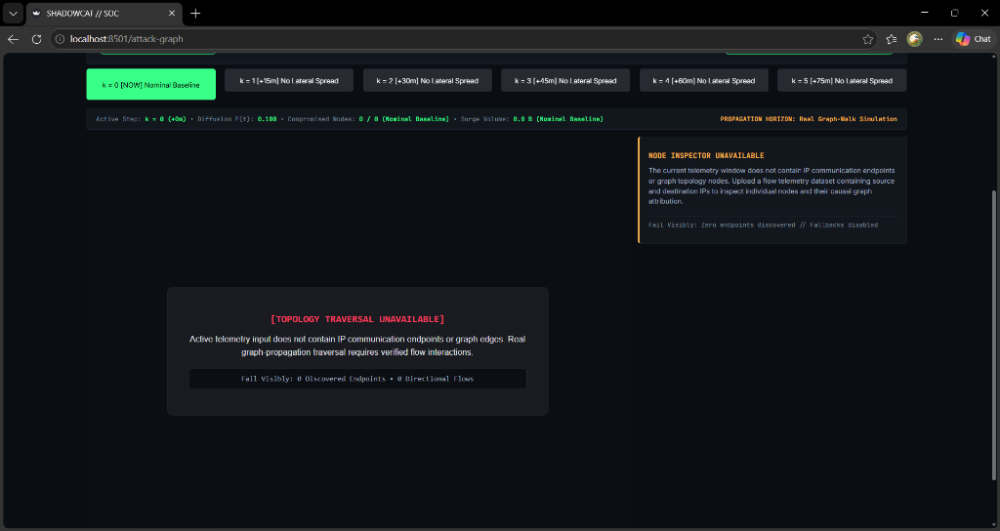

# SIH26153: SHADOWCAT Pipeline Architecture

**Theme:** Blockchain & Cybersecurity
**Organization:** National Technical Research Organisation (NTRO)

## 1. Unified Cyber State (UCS) & Data Ingestion
SHADOWCAT shifts perimeter defense from reactive signature matching to predictive forecasting. The pipeline begins with Gate 0 ingestion protocols.
* **Packet-Level Coverage:** The platform extracts real packet-level telemetry for all three headline attacks (**SSH-Bruteforce, Botnet, and DDOS-LOIC-UDP**) without label leakage.
* **Feature Extraction:** Raw NetFlows and Scapy-extracted packet stats are aggregated into 1-minute windows, yielding a 406-dimensional UCS feature vector ($S_t$).
* **Sanitization:** The data undergoes robust normalization (Log1p + RobustScaler) to ensure stability against extreme traffic spikes before passing to the ML track.

## 2. Causal Temporal World Model
The core of SHADOWCAT is a predictive world model that learns the latent dynamics of network traffic.
* **Architecture:** A Stacked Residual LSTM Ensemble takes a 30-window temporal lookback to map $S_t$ to a 32-D latent representation ($z_t$).
* **Probabilistic Forecasting:** The model learns the transition dynamics $p(S_{t+1} | S_t)$, forecasting the probabilistic next-state of the network up to 5 minutes into the future ($H=5$).
* **Graph Representation (Ablation):** While a GraphSAGE multimodal fusion branch (ML2) was explored for topological context, empirical ablation (Validation Loss 1.666 vs 1.932) led to it being held back in favor of the pure temporal model for the primary verified forecast.

## 3. Multi-Head Forecasting & Counterfactual Explainability
The latent state $z_t$ is processed by specialized heads to map predictions to actionable analyst insights.
* **Stacked & Calibrated Residual LSTM Ensemble:** Forecasts a multi-step risk trajectory (t+1 through t+5), bounded by a strict False Positive Rate ceiling (global τ=0.15, ≤5% false-alarm rate) to prevent alert fatigue.
* **Stage Head:** Maps the predicted threat to specific MITRE ATT&CK stages. Retrained on the full-packet-coverage dataset across all three attacks, the Stage Head achieves a verified **0.8627 accuracy** (386 test samples).
* **Counterfactual Explainability:** Integrated Gradients and NLL Novelty scoring are used to isolate the exact feature perturbations driving the model's alert (e.g., highlighting specific port sweeps or rhythm anomalies), allowing human analysts to trust and verify the ML decision boundary.

## 4. Tamper-Evident Audit Ledger (Blockchain Integration)
To satisfy the SIH Blockchain requirement, SHADOWCAT implements a two-tier notarization architecture, integrating a real blockchain as the primary tier and a hash chain as a resilient fallback.
* **Hyperledger Fabric (Primary):** The system connects to a real Go chaincode on a local Fabric test network (`shadowcat-notary-channel`). It records an atomic 4-stage prediction lineage (raw data, feature vector, model ID, prediction). The chaincode features autonomous incident response, natively creating an `IncidentResponseRecord` (e.g., `ISOLATE_HOST`) on-chain for HIGH/CRITICAL alerts, with a verified median commit latency of 2402.55ms.
* **SHA-256 Hash Chain (Fallback):** If the Fabric network is unreachable, the system automatically falls back to a cryptographic SHA-256 recursive hash chain to ensure uninterrupted, tamper-evident lineage without pipeline failure.
* **Tamper Evidence:** Any unauthorized alteration to historical metrics or model weights breaks the downstream cryptographic links and is instantly caught by the auditing systems.

## 5. Operational Interface
* **Analyst Dashboard:** A dark-mode Streamlit dashboard visualizes the forecasted risk trajectories, attribution, and benchmark audits in real-time.
* **Telemetry Viewer:** Dual-signal telemetry viewers give human analysts direct insight into the counterfactual attributions and the cryptographic provenance of every alert.
